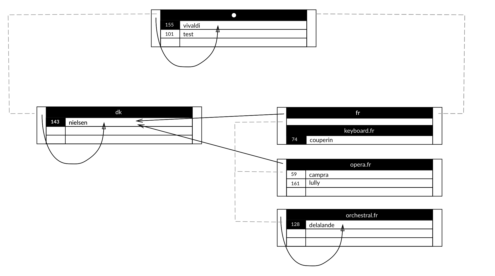

# DNS Hiërarchie

<p align="center">
    :construction: Work in Progress! :construction:
</p>

## Schema


## Debugging

### Poort

Het is zo dat DNS Servers met elkaar communiceren via het poortnummer `:53`.
Om te controleren of deze poort open is probeer je volgende commando uit vanaf een andere host:

```
nmap 192.168.16.??? -p 53
```

Het resultaat (state) moet `open` zijn.
Waarden als `closed` of `filtered` duiden een probleem aan.

**Controle**

Op de server waar de bind-instantie draait, voer je volgend commando uit:

```
netstat -lntp
```

Deze toont op welke poorten er geluisterd wordt.
Zorg dat er geluisterd wordt op poort `53`.

**Mogelijkse oplossing**

```
systemctl start named.service
iptables --flush
```
